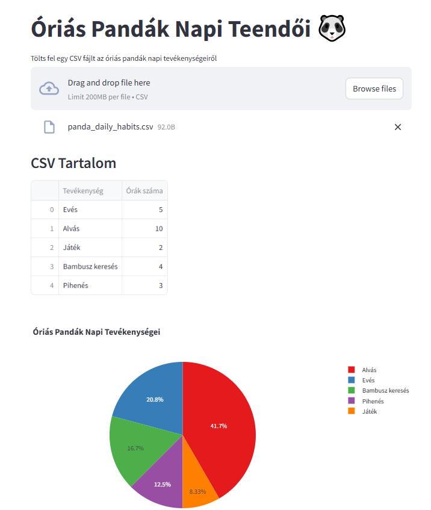

# Pandák Napi Szokásainak Vizualizációja
Devops kötprog by Füle Szabolcs CEVLCW 2024

## Áttekintés

Ez a projekt egy **Python Streamlit** alkalmazás, amely a pandák fiktív napi szokásait jeleníti meg grafikonokon. Az adatokat a **panda_daily_habits.csv** fájlban vannak tárolva.

---

## Felhasznált technológiák
- A verziókezelést és a deploy folyamatot **GitHub Actions** automatizálja.
- **CI/CD folyamat**:
  - Minden `push` indít egy workflow-t, amely:
    1. **Linter** futtatásával ellenőrzi a kódot.
    2. Hiba esetén email értesítést kapok.
    3. Ha minden ellenőrzés sikeres, az alkalmazást automatikusan deploy-olja.

